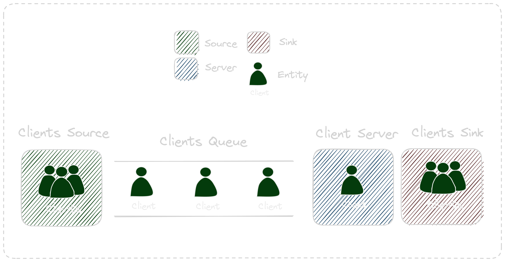

# Overview

## Introduction

[Discrete Event Simulation](https://en.wikipedia.org/wiki/Discrete-event_simulation) (DES) is a powerful modeling technique that enables the emulation of real-world systems by simulating individual events as they occur over time. In data science, DES serves as a critical tool for modeling dynamic systems and processes, aiding in understanding their behavior, optimizing performance, and making informed decisions.

The relevance of DES in data science is profound. It finds applications in diverse domains, including but not limited to operations research, supply chain management, healthcare systems, transportation, and finance. DES allows data scientists to simulate complex scenarios, analyze system behaviors under various conditions, and derive insights that aid in strategic planning and decision-making.

## Understanding Discrete Event Simulation

Discrete Event Simulation (DES) operates on the premise of modeling dynamic systems by tracking individual events as they occur at distinct points in time. It's a powerful technique employed to simulate and analyze systems where changes occur instantaneously, focusing on key events that drive system behavior.

### Fundamental Concepts of DES

At its core, DES revolves around **entities**, **events**, the simulation **clock**, and **queues**. 

- Entities represent the objects or elements within the system under observation. 
- Events, triggered by entities, denote occurrences that affect the system's state or condition. 
- The simulation clock marks discrete instances when these events transpire, driving the progression of time within the simulated environment. 
- Queues play a pivotal role in managing and processing entities, representing waiting lines or buffers where entities await processing or service.

If we go one abstraction layer up, common DES components can be classified into **sources**, **servers** (with or withtout queues) and **sinks**.
- Sources are responsible of producing entities and inserting them into the simulating system. Times between arrival and amount of entities per arrival are common parameters of sources.
- Servers are in charge of delaying entities in the system for a given time period defined usually as a processing time.
- Sinks are used to remove entities from the simlating system and are useful to collect information about times spend by entities and performance of the overall system.

<figure markdown>
  { width="500" }
</figure>

## Applications and Use Cases

DES finds wide-ranging applications in modeling real-world systems across diverse domains. For instance, in manufacturing, DES facilitates the optimization of production lines by simulating the movement of materials or resources through different stages of the manufacturing process. In logistics and transportation, DES helps in modeling traffic flow, allowing analysts to simulate congestion scenarios or evaluate route optimization strategies.

Moreover, DES proves invaluable in healthcare systems for analyzing patient flow through hospitals or clinics, optimizing resource allocation, and evaluating the impact of different operational strategies. Financial institutions leverage DES to model transaction processing, simulate market behavior, or evaluate risk management strategies.

Understanding the core concepts of DES forms the foundation for constructing models that emulate the behavior of real-world systems. The versatility of DES in simulating various scenarios and its applicability across industries underscores its significance in data science for modeling complex dynamic systems and deriving insights that aid in decision-making and system optimization.

- Workflow Modeling: DES enables data scientists to model complex workflows within systems, aiding in understanding process dynamics. For instance, in software development, DES can simulate the flow of tasks in an Agile environment, allowing for optimization of development processes.

- Process Optimization: Data scientists leverage DES to optimize manufacturing processes, supply chain operations, or service systems. By simulating different scenarios, DES helps identify bottlenecks and inefficiencies, thereby enabling data-driven process improvements.

- Resource Allocation Analysis: DES aids in analyzing resource allocation strategies. For instance, in healthcare, it can model patient flow in hospitals to optimize staff allocation or bed utilization.

### Advantages of DES

- Case Study: System Performance Evaluation: Consider a data center where DES can model server operations, traffic loads, and network congestion. Utilizing DES allows for sophisticated analysis, aiding in predicting system performance under varying workloads.

- Predictive Modeling: DES serves as a predictive modeling tool. For instance, in predictive maintenance, DES can simulate equipment failure scenarios, enabling proactive maintenance scheduling based on predicted failures.

- Cost-Effective Experimentation: DES allows for cost-effective experimentation in data science. Data scientists can simulate different strategies or scenarios without real-world implementation, reducing risks and costs associated with trial and error.

### Challenges and Limitations

While DES offers powerful capabilities, it's important to mention the  challenges and limitations when employing this approach.

- Complexity in Model Construction: Building DES models can be intricate, especially when modeling complex systems with numerous interacting entities and events. Handling intricate interactions and dependencies while ensuring model accuracy might pose challenges.

- Computational Resource Intensity: Simulating large-scale systems using DES might require substantial computational resources. Processing time and memory usage may increase significantly, impacting the feasibility of simulating extensive scenarios.

- Continuous vs. Discrete Systems: DES is suitable for modeling systems with discrete events. However, for systems where events occur continuously or in a continuous manner (e.g., physical systems with continuous processes), other simulation techniques like continuous simulation or differential equations might be more appropriate.

- Highly Stochastic Systems: In highly stochastic systems where the randomness of events is predominant, DES might become less effective in predicting outcomes accurately. In such cases, Monte Carlo simulations or other probabilistic modeling methods might offer better insights.

Understanding the challenges and limitations of employing DES is crucial. Mitigating challenges through model abstraction, optimization techniques, and recognizing scenarios where DES might not be the optimal solution ensures more informed decision-making in selecting appropriate simulation methodologies.

